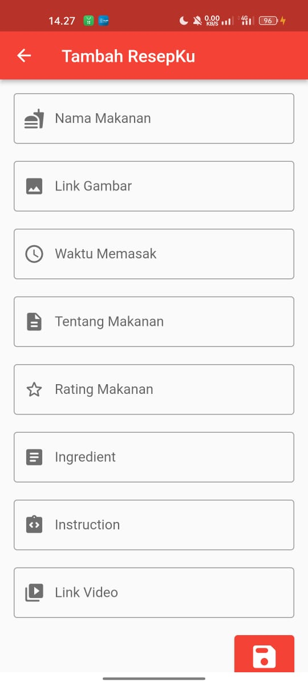

# ResepKu
 

Aplikasi ResepKu adalah kunci rahasia untuk menjadikan pengalaman memasak Anda lebih menyenangkan dan terorganisir. Dengan fokus pada kepraktisan dan personalisasi, aplikasi ini dirancang untuk memenuhi kebutuhan unik setiap pengguna dalam menyimpan, dan berbagi resep makanan favorit pengguna.

## Nama Kelompok
<table border="1">
  <thead>
    <tr>
      <td>No</td>
      <td>NIM</td>
      <td>Nama Anggota</td>
    </tr>
  <thead>
  <tbody>
    <tr>
      <td>1</td>
      <td>15220292</td>
      <td>Aldyansyah Tarigan</td>
    </tr>
    <tr>
      <td>2</td>
      <td>15220099</td>
      <td>Fachrizky Catur Putra</td>
    </tr>
    <tr>
      <td>3</td>
      <td>15220566</td>
      <td>Clara Pratiwi</td>
    </tr>
    <tr>
      <td>4</td>
      <td>15220828</td>
      <td>Maria Erviana Asinta Lensi</td>
    </tr>
  </tbody>
</table>

## 💻 Pengguna Sistem
Pengguna yang dapat memakai sistem ini adalah User.

## 👨‍💻 Skenario Kebutuhan Pengguna
### User
<ol>
  <li>User dapat menambahkan resep makanan.</li>
  <li>User dapat menambahkan foto & video resep.</li>
  <li>User dapat melihat resep yang sudah dibuat.</li>
  <li>User dapat mengedit resep yang sudah dibuat.</li>
  <li>User dapat melihat foto & video resep.</li>
</ol>

## 🖼️ Screenshot Aplikasi
<table width="100%">
  <tbody>
    <tr>
      <td width="33%">
        <h5>Home</h5>
         
      </td>
      <td width="33%">
        <h5>Form Tambah Resep</h5>
        
      </td>
      <td width="33%">
        <h5>Detail Resep</h5>
        
      </td>
    </tr>
    <tr>
      <td width="33%">
        <h5>Form Edit Resep</h5>
         
      </td>
      <td width="33%">
        <h5>Alert Hapus</h5>
        
      </td>
      <td width="33%">
        <h5>Video Resep</h5>
        
      </td>
    </tr>
  </tbody>
</table>
<!-- Boleh tambahkan jumlah screenshot lebih dari 3 gambar agar lebih lengkap dalam pengenalan aplikasinya -->

## 📝 Prerequisite
Untuk menjalankan aplikasi ini disarankan untuk menyiapkan aplikasi berikut ini :
  - [x] Android Studio Giraffe <code>2022.03.1 Patch 1</code>
  - [x] Flutter <code>3.13.2</code>
  - [x] Dart <code>3.1.0</code>
  - [x] Java JDK <code>19.0.0</code>
  - [x] Git <code>2.35.1</code>

## Credit
Project ini mengacu pada modul praktik dari mata kuliah Mobile Programming Universitas Bina Sarana Informatika (UBSI) yang diampu oleh Bpk. <a href="https://github.com/yuris60">Yuris Alkhalifi, M.Kom., CPDSA</a> selaku Dosen.